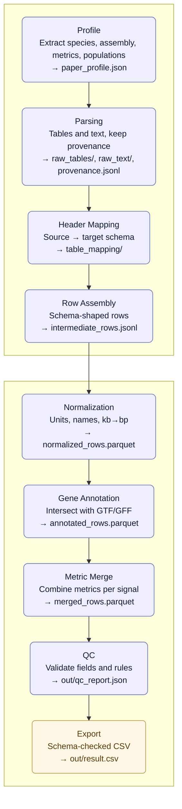

# PSSDB — From Papers to a Standardized Dataset (GitHub-safe)

Below is a clean, presentation-ready view of how we turn **PDF articles + supplements** into a **strict, merge-ready CSV** for the central database.

## Block Diagram (S-shaped overview)

## Pipeline at a Glance (what each step does and why)

**1) Profile (context).** We read the article once to capture the contract for this dataset: species and genome assembly, which selection metrics and thresholds were used, what populations are compared, and the citation. This becomes `paper_profile.json` and guides every decision later.

**2) Parsing (mechanical intake).** We extract all tables and text as-is from PDFs/DOCX/XLSX/TSV and save a provenance trail (which file/sheet/page each row came from). No interpretation yet — just a clean, lossless snapshot in `raw_tables/` plus `raw_text/` and `provenance.jsonl`.

**3) Header Mapping (bridge to our schema).** Source headers are mapped to the fixed PSSDB schema (for example, Chr → chrom, BP → snp_pos). Any targets with no source are listed explicitly. The output makes the conversion repeatable and auditable.

**4) Row Assembly (schema-shaped rows).** Each parsed table becomes rows with our exact fields. Coordinates are placed into (chrom, start, end, snp_pos, is_snp), populations come from the profile, and supplement_id points back to the source. If a metric is mentioned but no numbers are given, we set the corresponding presence flag to “used”.

**5) Normalization (make rows comparable).** We standardize units and names (for example, kb to bp, assembly and population aliases, canonical metric names) and enforce strict types. Rows from different files become comparable.

**6) Gene Annotation (biological context).** Using the specified assembly, we intersect coordinates with GTF/GFF to fill gene_symbol, gene_id, and gene_overlap_type (for example, exon, intron, nearby).

**7) Metric Merge (one signal, many metrics).** Signals that refer to the same SNP or the same genomic window plus population pair are merged into one record, filling Fst, XP-EHH, iHS and other metrics side by side.

**8) QC (trustworthy output).** We run consistency checks: coordinate logic, population fields, presence flags versus numeric values, and mandatory metadata. Only a green QC produces the final files.

**9) Export (ready for the database).** We write a CSV in the exact column order required by PSSDB and validate it against our table schema. The result is out/result.csv — merge-ready, reproducible, and traceable back to its sources.
