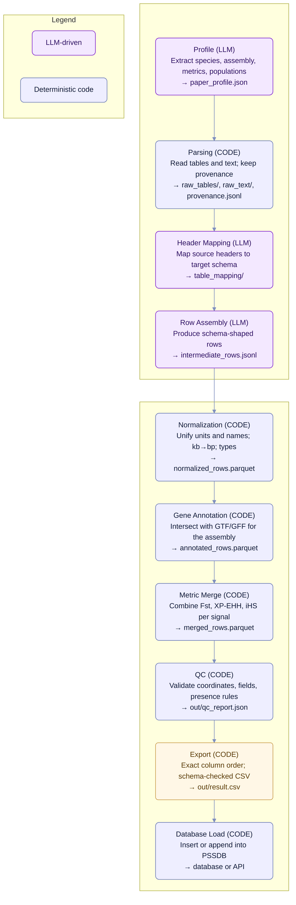

# PSSDB — From Papers to a Standardized Dataset (Ingestion Pipeline)

The diagram and summary below describe how the ingestion component converts **PDF articles and supplements** into a **strict, merge‑ready CSV** and then **loads it into the database**.

## Block Diagram 

## Pipeline at a Glance 

1) **Profile (context).** The article is analyzed once to capture the dataset contract: species and genome assembly, selection metrics and thresholds, comparison populations, and citation metadata. The result is saved as paper_profile.json and used to guide all subsequent steps.

2) **Parsing (mechanical intake).** All tables and text are extracted as-is from PDFs/DOCX/XLSX/TSV. A provenance trail records the origin of each row (file, sheet, page). No interpretation is performed at this stage.

3) **Header Mapping (bridge to the schema).** Source column names are mapped to the fixed PSSDB schema (for example, Chr → chrom, BP → snp_pos). Missing targets are listed explicitly to keep the process auditable and repeatable.

4) **Row Assembly (schema-shaped rows).** Parsed tables are converted into rows with the exact fields of the target schema. Coordinates are placed into (chrom, start, end, snp_pos, is_snp); populations follow the profile; supplement_id points to the original source. If a metric is used but has no numeric values, the corresponding presence flag is set to “used”.

5) **Normalization (comparability).** Units and names are standardized (for example, kb to bp, canonical metric and assembly names, population aliases), and strict data types are enforced. Rows from different files become directly comparable.

6) **Gene Annotation (biological context).** Using the specified assembly, genomic intervals are intersected with GTF/GFF to fill gene_symbol, gene_id, and gene_overlap_type (such as exon, intron, nearby).

7) **Metric Merge (one signal, many metrics).** Records that describe the same SNP or the same genomic window plus population pair are merged into a single row, bringing Fst, XP‑EHH, iHS, and other metrics together.

8) **QC (trustworthy output).** Consistency checks validate coordinate logic, population fields, presence flags versus numeric values, and mandatory metadata. Only a successful QC produces final artifacts.

9) **Export (merge‑ready CSV).** Data are written in the exact column order required by PSSDB and validated against the table schema. The deliverable is out/result.csv, reproducible and traceable to its sources.

10) **Database Load (ingestion into PSSDB).** The validated CSV is inserted or appended to the central database (or posted to an API endpoint), completing the ingestion cycle and making the data available for browsing and downstream analyses.

## Detailed Step Descriptions

**Step 1 — Profile (LLM)**
Purpose
Establish a machine-readable “contract” for the paper so downstream steps know the species, assembly, metrics, populations, and citation context.

Inputs

input/paper.pdf (or equivalent)

Optional: input/overrides.yaml (pre-known species/assembly)

Outputs

out/paper_profile.json (strict JSON)

logs/profile.provenance.json (tool versions, hashes, pages seen)

Responsibilities (checklist)

 Extract plain text from the PDF (layout-aware; OCR if scanned).

 Identify species and common name.

 Identify genome assembly exactly as used for selection scans.

 List selection metrics (e.g., Fst, XP-EHH, iHS, nSL, XP-CLR, H12, H2/H1, ω, π, Tajima’s D).

 Capture thresholds/windowing if stated (e.g., 100 kb windows, |iHS| > 2.58).

 Capture populations and aliases (e.g., NeC, NeS, NeT).

 Record citation metadata (DOI, PMID, title, URL).

 Store notes for any ambiguity (do not guess).

LLM contract

The prompt requires output as strict JSON matching the profile schema (no free text).

Unknown/unstated fields must be left empty (no hallucination).

The model may add clarifying notes to a notes field, but must not invent data.

Shape (illustrative, not exhaustive)

json
Copy
Edit
{
  "species": "Bos taurus",
  "common_name": "cattle (Nelore breed)",
  "assembly": "UMD3.1.1",
  "doi": "10.1186/s12711-018-0381-2",
  "pmid": "",
  "article_title": "...",
  "article_url": "https://doi.org/...",
  "metrics": [
    {"name": "Fst", "threshold": "top 1% per 100-kb window", "windowing": "100 kb, 75 kb overlap", "note": ""},
    {"name": "XP_EHH", "threshold": "mean > 2.58", "windowing": "100 kb", "note": ""}
  ],
  "populations": [
    {"name": "Nelore Control", "aliases": ["NeC"], "note": ""},
    {"name": "Nelore Selection", "aliases": ["NeS"], "note": ""}
  ],
  "notes": "..."
}
Validation

JSON is validated against a jsonschema (required keys, types).

Cross-checks:

Assemblies mentioned in text vs selected for scans.

Population aliases present in tables/figures.

Threshold strings parsable when present.

On failure: generate a compact error report and re-prompt the same LLM to fix only the listed issues.

Provenance & caching

Save PDF hash, OCR flag, extractor version, and page ranges in logs/profile.provenance.json.

If hashes and tool versions match, the step is skipped (cache hit).

Failure modes to watch

Multiple assemblies mentioned; pick the one explicitly used for scans, note alternatives in notes.

Metrics cited in text but not used in results; mark as such in notes (downstream will use *_presence="used" if needed).
