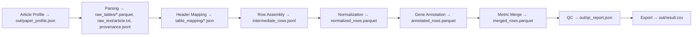

# phhackathon_almaty
Establishing a One-St# PSSDB — From Papers to a Standardized Dataset

This document explains how the ingestion component turns **PDF articles and supplements** into a **strictly standardized CSV** that can be merged into the central database.

## Block Diagram

## Pipeline in Short
**Article profile.** We extract species, assembly, metrics/thresholds, populations, DOI/PMID/title from the PDF. A small LLM task returns a **strict JSON** (`paper_profile.json`), validated with jsonschema.  
**Parsing.** Deterministic scripts read all tables and text as-is (pdfplumber / PyMuPDF, camelot/tabula, python-docx, openpyxl/pandas; pytesseract for scans). Output includes raw tables and **provenance** (file/sheet/page for each row).  
**Header mapping.** A small LLM maps source headers to the target CSV schema, returning a JSON map; missing targets are explicit.  
**Row assembly.** Tables are converted into our schema rows: coordinates normalized to `(chrom, start, end, snp_pos, is_snp)`, populations taken from the profile, `supplement_id` set. If a metric is used but has no numbers, we set `*_presence="used"`.  
**Normalization.** Units (kb→bp), metric/assembly/population names via YAML dictionaries; strict types.  
**Gene annotation.** Intersect coordinates with assembly-specific GTF/GFF to fill `gene_symbol/gene_id/gene_overlap_type`.  
**Metric merge.** Combine Fst, XP-EHH, iHS, etc. into **one record per signal** (SNP or window + population pair).  
**QC and export.** `pandera` / Great Expectations enforce invariants (coordinate logic, presence vs numeric values, mandatory fields). On success we produce **`out/result.csv`** with the exact column order; the table is checked against a frictionless schema.

## Inputs & Outputs
**Input:** a folder with the article and all supplements (PDF/DOCX/XLSX/CSV/TSV/PDF).  
**Output:**  
- `out/result.csv` — final file for database merge;  
- `out/qc_report.json` — validation report;  
- `out/paper_profile.json` — article context;  
- `provenance.jsonl` — full lineage for transparency and reproducibility.

## LLM vs Deterministic Code
LLM is used **only** for semantic interpretation: article profiling and header mapping/row assembly. In all cases it must return **strict JSON** that is validated (and, if needed, auto-fixed by an “Auditor” pass using the validator’s error list). Parsing, normalization, annotation, QC, and export are deterministic scripts.

## Why it is Robust
Clear separation of “mechanics” and “semantics”, compulsory schemas and validation, provenance logs, reproducible DAG with caching, and explicit rules for incomplete data (`*_presence="used"`, gene-only rows when coordinates are missing). This removes repetitive manual work and keeps additions consistent and auditable.
op Species-Agnostic Database of Positive Selection Signals
