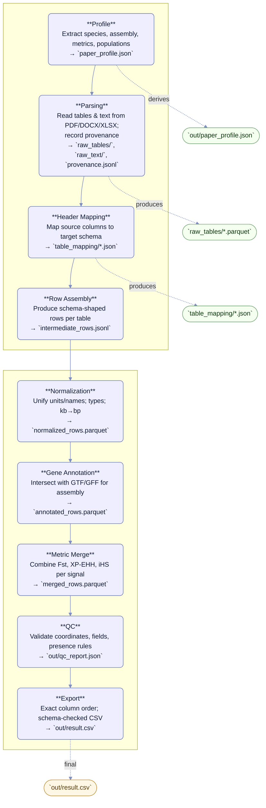

# PSSDB — From Papers to a Standardized Dataset (Ingestion Pipeline)

Below is a clean, presentation‑ready view of how we turn **PDF articles + supplements** into a **strict, merge‑ready CSV** for the central database.

## Block Diagram (S‑shaped overview)

## Pipeline at a Glance (what each step does and why)

**1) Profile (context).** We read the article once to capture the **contract** for this dataset: species and genome assembly, which **selection metrics** (e.g., Fst, XP‑EHH, iHS) and **thresholds** were used, what **populations** are compared, and the citation (DOI/PMID/title). This becomes `paper_profile.json` and guides every decision later (e.g., pair directions, window sizes).

**2) Parsing (mechanical intake).** We extract all tables and text **as‑is** from PDFs/DOCX/XLSX/TSV and save a **provenance trail** (which file/sheet/page each row came from). No interpretation yet — just a clean, lossless snapshot in `raw_tables/` plus `raw_text/` and `provenance.jsonl`.

**3) Header Mapping (bridge to our schema).** Source headers are mapped to the **fixed PSSDB schema** (e.g., `Chr`→`chrom`, `BP`→`snp_pos`). Any targets with no source are listed explicitly. The output (`table_mapping/*.json`) makes the conversion repeatable and auditable.

**4) Row Assembly (schema‑shaped rows).** Each parsed table becomes rows with our exact fields. Coordinates are placed into `(chrom, start, end, snp_pos, is_snp)`, populations come from the profile, and `supplement_id` points back to the source. If a metric is mentioned but no numbers are given, we set `*_presence="used"`.

**5) Normalization (make rows comparable).** We standardize units and names (e.g., **kb→bp**, assembly/population aliases, canonical metric names) and enforce strict types. Now rows from different files look and behave the same.

**6) Gene Annotation (biological context).** Using the specified **assembly**, we intersect coordinates with **GTF/GFF** to fill `gene_symbol`, `gene_id`, and `gene_overlap_type` (e.g., exon/intron/nearby).

**7) Metric Merge (one signal, many metrics).** Signals that refer to the **same SNP** or **same genomic window + population pair** are merged into **one record**, filling Fst / XP‑EHH / iHS (and other metrics) side‑by‑side.

**8) QC (trustworthy output).** We run a battery of consistency checks: coordinate logic, population fields, **presence flags vs numeric values**, and mandatory metadata. Only a **green** QC produces the final files.

**9) Export (ready for the database).** We write a CSV in the **exact column order** required by PSSDB, and validate it against our table schema. The result is `out/result.csv` — merge‑ready, reproducible, and traceable back to its sources.

## Inputs & Outputs
**Input:** a folder with the article and all supplements (PDF/DOCX/XLSX/CSV/TSV/PDF).  
**Output:**  
- `out/result.csv` — final file for database merge;  
- `out/qc_report.json` — validation report;  
- `out/paper_profile.json` — article context;  
- `provenance.jsonl` — full lineage for transparency and reproducibility.

## LLM vs Deterministic Code
LLM is used **only** for semantic interpretation: article profiling and header mapping/row assembly. In all cases it must return **strict JSON** that is validated (and, if needed, auto-fixed by an “Auditor” pass using the validator’s error list). Parsing, normalization, annotation, QC, and export are deterministic scripts.

## Why it is Robust
Clear separation of “mechanics” and “semantics”, compulsory schemas and validation, provenance logs, reproducible DAG with caching, and explicit rules for incomplete data (`*_presence="used"`, gene-only rows when coordinates are missing). This removes repetitive manual work and keeps additions consistent and auditable.
op Species-Agnostic Database of Positive Selection Signals
